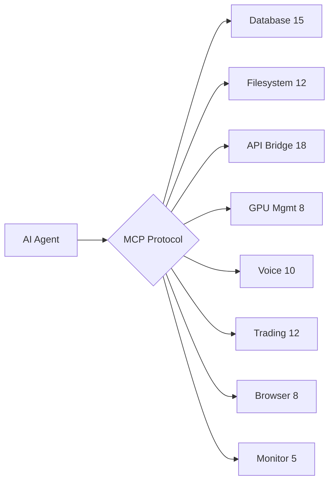

# 🔧 JARVIS MCP Toolkit

**88+ MCP handlers for autonomous AI agents on a 6-GPU cluster**

## Architecture

## Handler Categories

| Category | Count | Examples |
|----------|-------|---------|
| Database | 15 | SQLite CRUD, search, analytics |
| Filesystem | 12 | Read, write, watch, backup |
| API | 18 | REST, WebSocket, MCP bridge |
| GPU | 8 | VRAM, thermal, model loading |
| Voice | 10 | STT, TTS, Whisper commands |
| Trading | 12 | MEXC, signals, consensus |
| Browser | 8 | CDP, screenshots, scraping |
| System | 5 | Health, monitoring, alerts |

## Part of [JARVIS OS](https://github.com/Turbo31150/jarvis-linux)

[TradeOracle](https://github.com/Turbo31150/TradeOracle) · [WhisperFlow](https://github.com/Turbo31150/jarvis-whisper-flow) · [LUMEN](https://github.com/Turbo31150/lumen)
