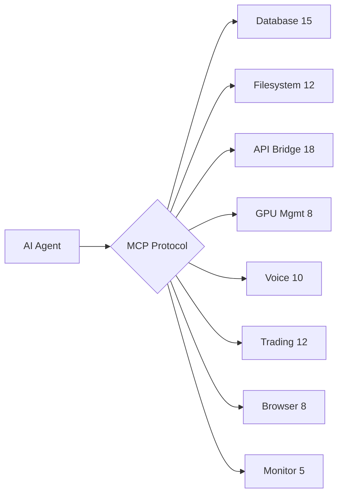
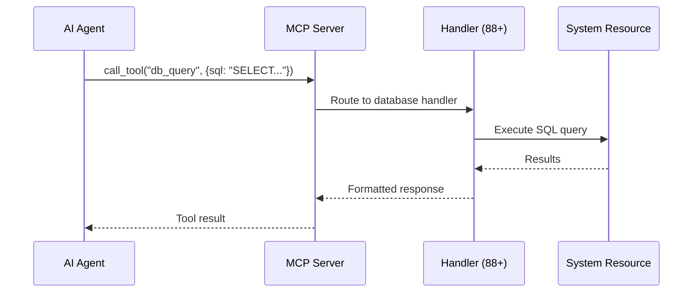

<div align="center">

# 🔧 JARVIS MCP Toolkit

[](https://modelcontextprotocol.io)
[](https://python.org)
[](https://nvidia.com)

**88+ MCP handlers for autonomous AI agents on a 6-GPU cluster**

</div>

## Architecture



## 88 Handlers by Category

| Category | Count | Key Operations |
|----------|-------|----------------|
| **Database** | 15 | CRUD, search, analytics, backup, migration |
| **Filesystem** | 12 | Read, write, watch, tree, backup, sync |
| **API Bridge** | 18 | REST proxy, WebSocket, MCP relay, auth |
| **GPU Management** | 8 | VRAM, thermal, model load/unload, benchmark |
| **Voice** | 10 | STT (Whisper), TTS, commands, wake word |
| **Trading** | 12 | MEXC, signals, consensus, TP/SL, portfolio |
| **Browser** | 8 | CDP navigate, click, fill, screenshot, scrape |
| **System** | 5 | Health, logs, alerts, metrics, restart |

## Quick Start

```python
from jarvis_mcp import MCPServer

server = MCPServer(handlers="all")
server.start(port=8901)
# 88 tools now available via MCP protocol
```

## Integration

Works with any MCP-compatible client:
- **Claude Code** — via `.mcp.json`
- **Gemini CLI** — via `settings.json`
- **BrowserOS** — native MCP support
- **Custom agents** — via `core.router.dispatcher`

## Part of [JARVIS OS](https://github.com/Turbo31150/jarvis-linux)

[JARVIS Core](https://github.com/Turbo31150/jarvis-core) · [TradeOracle](https://github.com/Turbo31150/TradeOracle) · [WhisperFlow](https://github.com/Turbo31150/jarvis-whisper-flow)

**Franck Delmas** — [Portfolio](https://turbo31150.github.io/franckdelmas.dev/) · [LinkedIn](https://linkedin.com/in/franck-hlb-80bb231b1)


## What is MCP?

**Model Context Protocol** is a standard for AI agents to interact with external tools. Instead of coding custom integrations for each tool, MCP provides a unified interface — like USB for AI.

JARVIS MCP Toolkit provides **88+ ready-to-use handlers** that let any AI agent:
- Read/write databases
- Control the browser
- Manage GPU resources
- Execute voice commands
- Monitor system health
- Trade on MEXC

## Usage Examples

```python
# Example 1: AI agent uses database tool
agent.call_tool("db_query", {
    "database": "jarvis-master",
    "sql": "SELECT * FROM codeur_offers"
})
# → Returns 6 offers

# Example 2: AI agent controls browser
agent.call_tool("browser_navigate", {
    "url": "https://codeur.com/projects"
})
agent.call_tool("browser_screenshot", {})
# → Returns screenshot of the page

# Example 3: AI agent checks GPU
agent.call_tool("gpu_status", {})
# → {gpu0: {temp: 52, vram: 9.6/12GB}, ...}
```

## Why 88 Handlers?

Most MCP toolkits offer 5-10 tools. JARVIS needs **comprehensive coverage** because it manages an entire infrastructure: databases, GPU cluster, voice pipeline, trading engine, browser automation, and monitoring — all accessible through a single protocol.


## How MCP Works in JARVIS



## Real Integration Examples

### With Claude Code
```json
// .mcp.json
{
  "mcpServers": {
    "jarvis": {
      "command": "python3",
      "args": ["-m", "jarvis_mcp", "--port", "8901"]
    }
  }
}
// Now Claude Code can: query DBs, control browser, check GPU, run scripts
```

### With Gemini CLI
```json
// ~/.gemini/settings.json
{
  "mcpServers": {
    "jarvis-mcp": {
      "command": "python3",
      "args": ["-m", "jarvis_mcp"],
      "timeout": 30000
    }
  }
}
```

### With Custom Python Agent
```python
from jarvis_mcp import MCPClient

client = MCPClient("http://localhost:8901")

# List all available tools
tools = client.list_tools()
# → 88 tools: db_query, browser_navigate, gpu_status, voice_command, ...

# Call any tool
result = client.call("gpu_status")
# → {gpu0: {temp: 52, vram: "9.6/12GB"}, gpu1: ...}

# Chain tools
data = client.call("db_query", {"sql": "SELECT * FROM codeur_offers"})
client.call("telegram_send", {"message": f"Found {len(data)} offers"})
```

## Handler Deep Dive

### Database Handlers (15)
```
db_query       — Execute read-only SQL
db_insert      — Insert with validation
db_tables      — List all tables
db_schema      — Get table schema
db_export      — Export to JSON/CSV
db_health      — Check integrity
db_backup      — Create backup copy
db_search      — Full-text search
db_stats       — Row counts, sizes
db_migrate     — Schema migration
...
```

### GPU Handlers (8)
```
gpu_status     — Temperature, VRAM, utilization
gpu_models     — List loaded models
gpu_load       — Load a model
gpu_unload     — Free VRAM
gpu_benchmark  — Speed test
gpu_thermal    — Thermal throttle check
gpu_allocate   — Reserve VRAM for task
gpu_optimize   — Suggest optimal allocation
```


---

## License

MIT License — Free for personal and commercial use.

## Author

**Franck Delmas** — AI Systems Architect
- [GitHub](https://github.com/Turbo31150) · [Portfolio](https://turbo31150.github.io/franckdelmas.dev/) · [LinkedIn](https://linkedin.com/in/franck-hlb-80bb231b1)

Part of [JARVIS OS](https://github.com/Turbo31150/jarvis-linux) ecosystem.


---

## Full Handler Reference

### Database Handlers (15)

| Handler | Description | Access |
|---------|-------------|--------|
| `db_query` | Execute read-only SQL queries against any managed database | Read-only |
| `db_insert` | Insert records with schema validation and type checking | Write |
| `db_update` | Update existing records with WHERE clause enforcement | Write |
| `db_delete` | Delete records with mandatory confirmation prompt | Write (confirm) |
| `db_tables` | List all tables in a specified database | Read-only |
| `db_schema` | Return column names, types, and constraints for a table | Read-only |
| `db_export` | Export table or query results to JSON or CSV format | Read-only |
| `db_health` | Check database integrity (PRAGMA integrity_check) | Read-only |
| `db_backup` | Create a timestamped backup copy of a database file | Write |
| `db_search` | Full-text search across all text columns in a table | Read-only |
| `db_stats` | Return row counts, file sizes, and last-modified timestamps | Read-only |
| `db_migrate` | Apply schema migrations from migration files | Write (confirm) |
| `db_vacuum` | Reclaim unused space and optimize database file | Write |
| `db_index` | Create or drop indexes for performance tuning | Write |
| `db_attach` | Attach a secondary database for cross-DB queries | Read-only |

### Filesystem Handlers (12)

| Handler | Description | Access |
|---------|-------------|--------|
| `fs_read` | Read file contents with optional encoding detection | Read-only |
| `fs_write` | Write content to a file with backup creation | Write |
| `fs_list` | List directory contents with optional filtering | Read-only |
| `fs_tree` | Generate directory tree structure up to N levels deep | Read-only |
| `fs_watch` | Watch a file or directory for changes (inotify) | Read-only |
| `fs_copy` | Copy files or directories with progress reporting | Write |
| `fs_move` | Move or rename files and directories | Write |
| `fs_delete` | Delete files with mandatory confirmation prompt | Write (confirm) |
| `fs_search` | Recursive file search by name, size, or modification date | Read-only |
| `fs_backup` | Create compressed backup archives of directories | Write |
| `fs_sync` | Rsync-based synchronization between directories or nodes | Write |
| `fs_permissions` | View or modify file permissions and ownership | Write |

### API Bridge Handlers (18)

| Handler | Description | Access |
|---------|-------------|--------|
| `api_get` | HTTP GET request with configurable headers and timeout | Read-only |
| `api_post` | HTTP POST request with JSON or form body | Write |
| `api_put` | HTTP PUT request for resource updates | Write |
| `api_delete` | HTTP DELETE request with confirmation | Write (confirm) |
| `api_ws_connect` | Open a WebSocket connection to a specified URL | Write |
| `api_ws_send` | Send a message over an active WebSocket connection | Write |
| `api_ws_listen` | Listen for messages on a WebSocket (with timeout) | Read-only |
| `api_mcp_relay` | Forward MCP calls to a remote MCP server | Write |
| `api_mcp_list` | List tools available on a remote MCP server | Read-only |
| `api_auth_token` | Retrieve or refresh an OAuth2 token | Read-only |
| `api_auth_basic` | Set Basic Auth credentials for subsequent requests | Write |
| `api_proxy` | Proxy a request through a SOCKS5 or HTTP proxy | Write |
| `api_cache_get` | Retrieve a cached API response by key | Read-only |
| `api_cache_set` | Store an API response in the local cache | Write |
| `api_cache_clear` | Clear cached responses by prefix or age | Write |
| `api_rate_status` | Check current rate limit status for a given API | Read-only |
| `api_webhook_register` | Register a webhook endpoint for incoming data | Write |
| `api_graphql` | Execute a GraphQL query against any endpoint | Read-only |

### GPU Management Handlers (8)

| Handler | Description | Access |
|---------|-------------|--------|
| `gpu_status` | Return temperature, VRAM usage, utilization for all GPUs | Read-only |
| `gpu_models` | List currently loaded models with VRAM allocation | Read-only |
| `gpu_load` | Load a model onto a specific GPU with VRAM pre-check | Write (confirm) |
| `gpu_unload` | Unload a model to free VRAM | Write |
| `gpu_benchmark` | Run inference speed test on a loaded model | Read-only |
| `gpu_thermal` | Check thermal throttle state and fan speed | Read-only |
| `gpu_allocate` | Reserve VRAM for an upcoming task | Write |
| `gpu_optimize` | Suggest optimal model-to-GPU allocation | Read-only |

### Voice Handlers (10)

| Handler | Description | Access |
|---------|-------------|--------|
| `voice_stt` | Transcribe audio to text using Whisper | Read-only |
| `voice_tts` | Generate speech audio from text | Write |
| `voice_wake` | Activate wake word detection listener | Write |
| `voice_command` | Parse and execute a voice command string | Write |
| `voice_list_commands` | List all registered voice commands | Read-only |
| `voice_intent` | Classify intent from a voice transcript | Read-only |
| `voice_feedback` | Play audio feedback (confirmation beep, error tone) | Write |
| `voice_record` | Start/stop audio recording from microphone | Write |
| `voice_language` | Set or get the active speech language | Write |
| `voice_calibrate` | Calibrate microphone noise floor | Write |

### Trading Handlers (12)

| Handler | Description | Access |
|---------|-------------|--------|
| `trade_price` | Get current price for a trading pair on MEXC | Read-only |
| `trade_orderbook` | Fetch orderbook depth for a pair | Read-only |
| `trade_signal` | Generate a buy/sell/hold signal using AI consensus | Read-only |
| `trade_execute` | Place a market or limit order | Write (confirm) |
| `trade_cancel` | Cancel an open order | Write (confirm) |
| `trade_portfolio` | Return current portfolio balances | Read-only |
| `trade_history` | Fetch trade history for a pair or time range | Read-only |
| `trade_tp_sl` | Set take-profit and stop-loss on a position | Write |
| `trade_pnl` | Calculate profit/loss for open positions | Read-only |
| `trade_alert` | Set price alert for a pair and threshold | Write |
| `trade_consensus` | Query multiple models for trade consensus | Read-only |
| `trade_backtest` | Run a strategy backtest on historical data | Read-only |

### Browser Handlers (8)

| Handler | Description | Access |
|---------|-------------|--------|
| `browser_navigate` | Navigate a browser tab to a URL | Write |
| `browser_click` | Click an element by CSS selector | Write |
| `browser_fill` | Fill a form field by selector and value | Write |
| `browser_screenshot` | Capture a full-page or element screenshot | Read-only |
| `browser_scrape` | Extract structured data from the current page | Read-only |
| `browser_execute` | Execute JavaScript in the page context | Write |
| `browser_tabs` | List all open browser tabs | Read-only |
| `browser_close` | Close a specific browser tab | Write |

### System Handlers (5)

| Handler | Description | Access |
|---------|-------------|--------|
| `sys_health` | Return system health (CPU, RAM, disk, uptime) | Read-only |
| `sys_logs` | Fetch recent log entries with optional level filter | Read-only |
| `sys_alerts` | List active alerts and their severity | Read-only |
| `sys_metrics` | Return Prometheus-style metrics for all services | Read-only |
| `sys_restart` | Restart a managed service by name | Write (confirm) |

---

## Troubleshooting Guide

### Common Issues

**Problem: MCP server fails to start**
```
Error: Port 8901 already in use
```
Solution: Check for existing processes on the port and kill them.
```bash
lsof -i :8901 | grep LISTEN
kill -9 <PID>
```

**Problem: GPU handlers return "No GPU detected"**
```
Error: nvidia-smi not found or no NVIDIA driver
```
Solution: Ensure NVIDIA drivers are installed and `nvidia-smi` is in PATH. On Ubuntu:
```bash
sudo apt install nvidia-driver-535
nvidia-smi  # verify
```

**Problem: Database handlers return "Database locked"**
This occurs when multiple processes write to the same SQLite file simultaneously. Solutions:
1. Use WAL mode: `PRAGMA journal_mode=WAL;`
2. Set a busy timeout: `PRAGMA busy_timeout=5000;`
3. Ensure only one write-path at a time via the task executor queue.

**Problem: Voice handlers return "No audio device"**
Ensure PulseAudio or PipeWire is running and a microphone is connected:
```bash
pactl list sources short  # list audio inputs
arecord -l                # list ALSA capture devices
```

**Problem: Trading handlers timeout**
MEXC API has rate limits (20 requests/second). If you see timeouts:
1. Check `api_rate_status` for current limits
2. Reduce polling frequency
3. Use WebSocket feeds instead of REST for real-time data

---

## Extending the Toolkit

### Creating a New Handler

1. Create a new Python file in `handlers/`:

```python
# handlers/my_custom_handler.py
from jarvis_mcp.base import BaseHandler, handler

class MyCustomHandler(BaseHandler):
    """Handler for custom operations."""

    @handler("my_tool_name")
    async def my_tool(self, params: dict) -> dict:
        """One-line description shown in tool listing."""
        # Validate input
        value = params.get("key", "default")

        # Do work
        result = await self._process(value)

        # Return structured response
        return {"status": "ok", "data": result}

    async def _process(self, value: str) -> str:
        # Internal logic
        return f"Processed: {value}"
```

2. Register the handler in `config/handlers.yaml`:
```yaml
handlers:
  - name: my_custom
    module: handlers.my_custom_handler
    class: MyCustomHandler
    enabled: true
    category: custom
```

3. Restart the MCP server — your tool appears automatically in `list_tools()`.

### Handler Best Practices

- Always validate input parameters before processing
- Use `async` for any I/O operation (network, disk, database)
- Return structured dictionaries, not raw strings
- Include a one-line docstring — it becomes the tool description
- For write operations, consider adding a confirmation step
- Log errors with `self.logger.error()` for observability

---

## Security Model

### Access Levels

Each handler has one of three access levels:

| Level | Description | Behavior |
|-------|-------------|----------|
| **Read-only** | Cannot modify state | Executes immediately, no confirmation |
| **Write** | Modifies state | Executes immediately, logged for audit |
| **Write (confirm)** | Destructive or irreversible | Requires explicit confirmation before execution |

### Confirmation-Required Handlers

The following handlers require confirmation before execution to prevent accidental damage:

- `db_delete` — Deleting database records
- `db_migrate` — Applying schema migrations
- `fs_delete` — Deleting files from disk
- `gpu_load` — Loading models (consumes VRAM)
- `trade_execute` — Placing real orders with real money
- `trade_cancel` — Cancelling open orders
- `sys_restart` — Restarting production services

### Audit Trail

All handler invocations are logged to `jarvis-master.db` in the `mcp_audit` table:
```sql
CREATE TABLE mcp_audit (
    id INTEGER PRIMARY KEY,
    timestamp TEXT,
    handler TEXT,
    params TEXT,    -- JSON serialized
    result TEXT,    -- JSON serialized
    caller TEXT,    -- Which agent/user invoked
    duration_ms INTEGER
);
```

### Network Security

- The MCP server binds to `127.0.0.1` by default (localhost only)
- To expose to the cluster, set `MCP_BIND=0.0.0.0` and configure firewall rules
- All inter-node communication uses the local network (192.168.1.x)
- No authentication is required on localhost; remote access requires an API key set via `MCP_API_KEY`


---

<!-- jarvis-author-footer-v1 -->

<div align="center">

### Author

**Franck Delmas** — AI Systems Architect · JARVIS OS Creator · Toulouse, France

[](https://franckdelmas.dev)
[](https://github.com/Turbo31150)
[](https://www.linkedin.com/in/franck-hlb-80bb231b1/)
[](https://github.com/Turbo31150)

*Production-first autodidact · Multi-agent · MCP early adopter · Available for CDI / freelance / consulting.*

Part of the [JARVIS OS](https://github.com/Turbo31150/jarvis-linux) ecosystem ·
[All 44 public repos](https://github.com/Turbo31150?tab=repositories)

</div>
