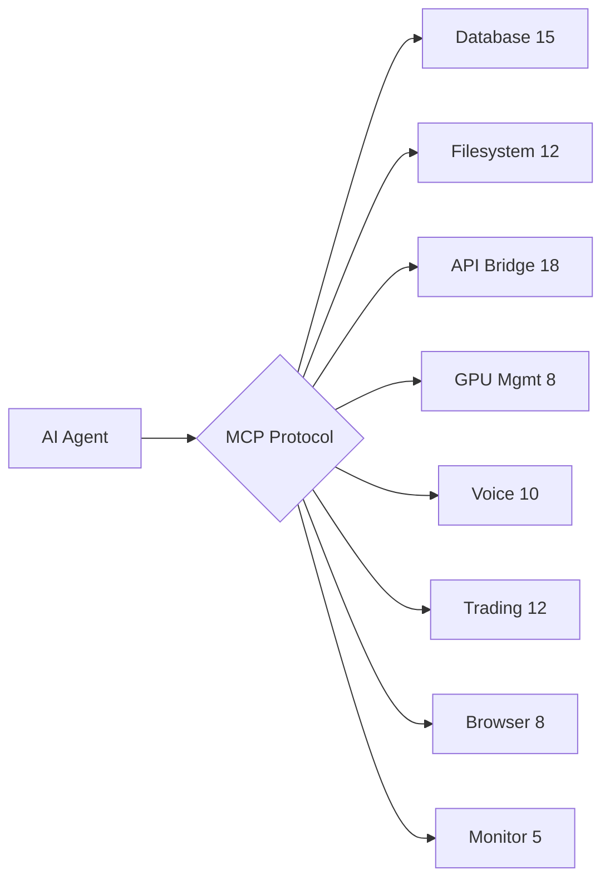
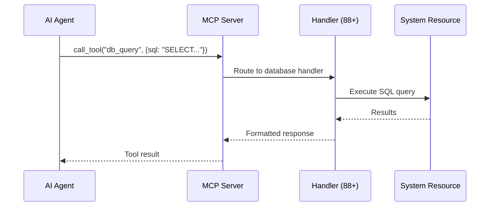

<div align="center">

# 🔧 JARVIS MCP Toolkit

[](https://modelcontextprotocol.io)
[](https://python.org)
[](https://nvidia.com)

**88+ MCP handlers for autonomous AI agents on a 6-GPU cluster**

</div>

## Architecture



## 88 Handlers by Category

| Category | Count | Key Operations |
|----------|-------|----------------|
| **Database** | 15 | CRUD, search, analytics, backup, migration |
| **Filesystem** | 12 | Read, write, watch, tree, backup, sync |
| **API Bridge** | 18 | REST proxy, WebSocket, MCP relay, auth |
| **GPU Management** | 8 | VRAM, thermal, model load/unload, benchmark |
| **Voice** | 10 | STT (Whisper), TTS, commands, wake word |
| **Trading** | 12 | MEXC, signals, consensus, TP/SL, portfolio |
| **Browser** | 8 | CDP navigate, click, fill, screenshot, scrape |
| **System** | 5 | Health, logs, alerts, metrics, restart |

## Quick Start

```python
from jarvis_mcp import MCPServer

server = MCPServer(handlers="all")
server.start(port=8901)
# 88 tools now available via MCP protocol
```

## Integration

Works with any MCP-compatible client:
- **Claude Code** — via `.mcp.json`
- **Gemini CLI** — via `settings.json`
- **BrowserOS** — native MCP support
- **Custom agents** — via `core.router.dispatcher`

## Part of [JARVIS OS](https://github.com/Turbo31150/jarvis-linux)

[JARVIS Core](https://github.com/Turbo31150/jarvis-core) · [TradeOracle](https://github.com/Turbo31150/TradeOracle) · [WhisperFlow](https://github.com/Turbo31150/jarvis-whisper-flow)

**Franck Delmas** — [Portfolio](https://turbo31150.github.io/franckdelmas.dev/) · [LinkedIn](https://linkedin.com/in/franck-hlb-80bb231b1)


## What is MCP?

**Model Context Protocol** is a standard for AI agents to interact with external tools. Instead of coding custom integrations for each tool, MCP provides a unified interface — like USB for AI.

JARVIS MCP Toolkit provides **88+ ready-to-use handlers** that let any AI agent:
- Read/write databases
- Control the browser
- Manage GPU resources
- Execute voice commands
- Monitor system health
- Trade on MEXC

## Usage Examples

```python
# Example 1: AI agent uses database tool
agent.call_tool("db_query", {
    "database": "jarvis-master",
    "sql": "SELECT * FROM codeur_offers"
})
# → Returns 6 offers

# Example 2: AI agent controls browser
agent.call_tool("browser_navigate", {
    "url": "https://codeur.com/projects"
})
agent.call_tool("browser_screenshot", {})
# → Returns screenshot of the page

# Example 3: AI agent checks GPU
agent.call_tool("gpu_status", {})
# → {gpu0: {temp: 52, vram: 9.6/12GB}, ...}
```

## Why 88 Handlers?

Most MCP toolkits offer 5-10 tools. JARVIS needs **comprehensive coverage** because it manages an entire infrastructure: databases, GPU cluster, voice pipeline, trading engine, browser automation, and monitoring — all accessible through a single protocol.


## How MCP Works in JARVIS



## Real Integration Examples

### With Claude Code
```json
// .mcp.json
{
  "mcpServers": {
    "jarvis": {
      "command": "python3",
      "args": ["-m", "jarvis_mcp", "--port", "8901"]
    }
  }
}
// Now Claude Code can: query DBs, control browser, check GPU, run scripts
```

### With Gemini CLI
```json
// ~/.gemini/settings.json
{
  "mcpServers": {
    "jarvis-mcp": {
      "command": "python3",
      "args": ["-m", "jarvis_mcp"],
      "timeout": 30000
    }
  }
}
```

### With Custom Python Agent
```python
from jarvis_mcp import MCPClient

client = MCPClient("http://localhost:8901")

# List all available tools
tools = client.list_tools()
# → 88 tools: db_query, browser_navigate, gpu_status, voice_command, ...

# Call any tool
result = client.call("gpu_status")
# → {gpu0: {temp: 52, vram: "9.6/12GB"}, gpu1: ...}

# Chain tools
data = client.call("db_query", {"sql": "SELECT * FROM codeur_offers"})
client.call("telegram_send", {"message": f"Found {len(data)} offers"})
```

## Handler Deep Dive

### Database Handlers (15)
```
db_query       — Execute read-only SQL
db_insert      — Insert with validation
db_tables      — List all tables
db_schema      — Get table schema
db_export      — Export to JSON/CSV
db_health      — Check integrity
db_backup      — Create backup copy
db_search      — Full-text search
db_stats       — Row counts, sizes
db_migrate     — Schema migration
...
```

### GPU Handlers (8)
```
gpu_status     — Temperature, VRAM, utilization
gpu_models     — List loaded models
gpu_load       — Load a model
gpu_unload     — Free VRAM
gpu_benchmark  — Speed test
gpu_thermal    — Thermal throttle check
gpu_allocate   — Reserve VRAM for task
gpu_optimize   — Suggest optimal allocation
```


---

## License

MIT License — Free for personal and commercial use.

## Author

**Franck Delmas** — AI Systems Architect
- [GitHub](https://github.com/Turbo31150) · [Portfolio](https://turbo31150.github.io/franckdelmas.dev/) · [LinkedIn](https://linkedin.com/in/franck-hlb-80bb231b1) · [Codeur](https://codeur.com/-6666zlkh)

Part of [JARVIS OS](https://github.com/Turbo31150/jarvis-linux) ecosystem.
